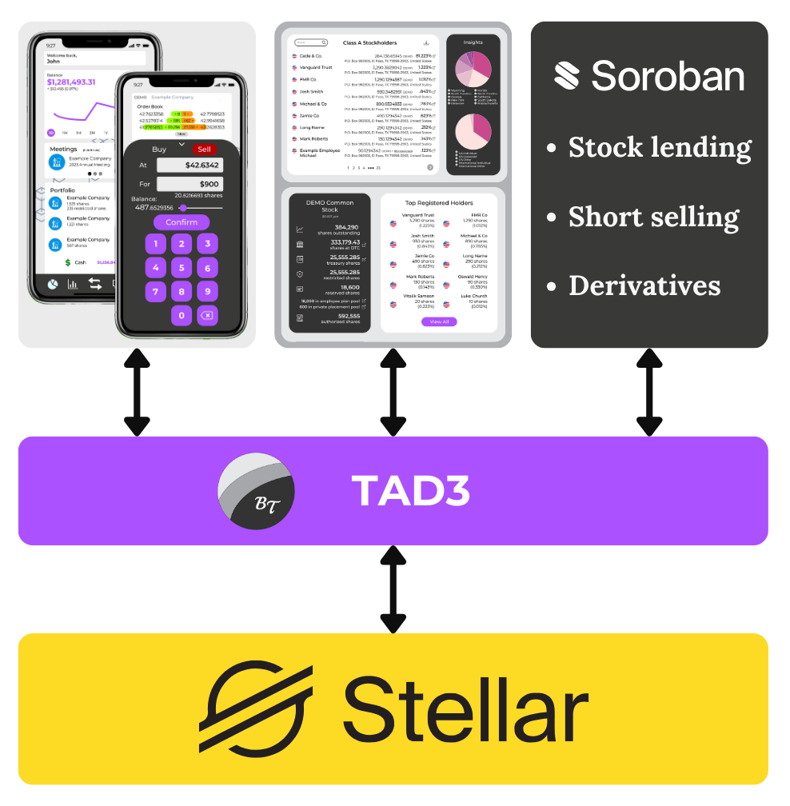

# TAD3 &mdash; The Blockchain DRS

TAD3 is designed to revolutionize the way we approach capital markets. Whether you are a developer, a stakeholder, or a new user, this documentation aims to provide all the necessary information to get you started and help you understand its core components.

- **Markets**: Explore market strategies and understand how TAD3 compares to CCP trade monopolies.
- **Governance**: Learn about the Syndicate's governance structure and how issuer proxy votes get made.
- **Transfers**: Get detailed information on underlying Stellar functions and how we manage data on-chain.

You can build the next generation of web3 Wall Street on TAD3 through projects like an [investor app](https://drive.blocktransfer.com/external/86c6601a688d1a04bb58a9694ae7ebc849820f71c18d39d48b6e1971147590dc), [company portal](https://drive.blocktransfer.com/external/e6d3aea8f0c7b4524ad217da3601e4412729ea6899804d053ffb2911e4f5666d), or [modern derivatives](https://drive.blocktransfer.com/external/7111b901ac531118f9675525baaed7523243b1ac38ddfa03e4bb023dc7315aa8).



We hope this documentation provides you with all the information you need. If you have any questions or need further assistance, please reach out to our [developer support](mailto:support@blocktransfer.dev).


<!-- Introduce market primatives from Yellowpaper -->
```{toctree}
:caption: Introduction:
:hidden:

intro
```

<!-- Introduce Stellar primatives with docs refs. -->
```{toctree}
:caption: Compliant Transfers:
:hidden:

transfers
```

<!-- Introduce Issuers.info, SNARK voting (ideal) -->
```{toctree}
:caption: Corporate Governance:
:hidden:

governance
```

<!-- Introduce GameStop, DRS movement, innovators -->
```{toctree}
:caption: Market Reform:
:hidden:

markets
```

<!-- Introduce global regulation, Procyon, DAO... -->
```{toctree}
:caption: Public Oversign:
:hidden:

oversight
```
