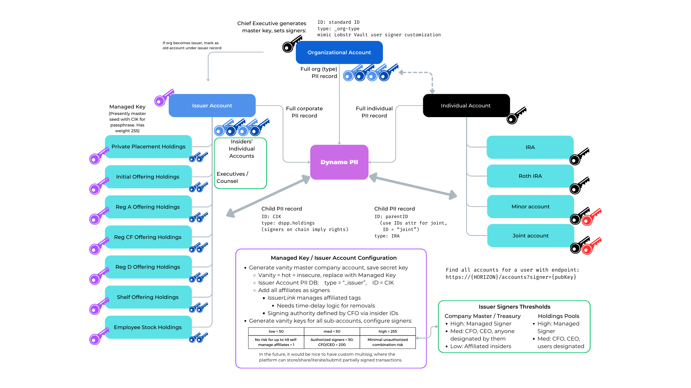

# Compliant Transfers

## Stellar Trustline Functions
[Stellar trustlines](https://developers.stellar.org/docs/building-apps/example-application-tutorial/manage-trust) are a fundamental component for ensuring secure and compliant asset transfers on the Stellar network. In TAD3, trustlines are utilized to ensure ongoing compliance and necessary control over asset ownership.[^policy_req] By using clawbackable and revocable trustlines, we can meet regulatory requirements and provide flexibility in stock market accessaility.

### Clawbackable Trustlines

A clawbackable trustline allows the issuer to reclaim assets from the holder under certain conditions. This feature is particularly useful for ensuring compliance with regulatory requirements, such as recovering assets involved in fraudulent activities or correcting errors. The ability to claw back assets provides issuers with a powerful tool to enforce compliance and maintain the integrity of the financial ecosystem.

### Revocable Trustlines

Revocable trustlines grant the issuer the authority to revoke the trustline, thereby preventing the holder from transferring the asset. This control mechanism is essential for managing compliance, particularly in situations where the holder violates terms of service or regulatory requirements. By revoking trustlines, issuers can effectively freeze assets and prevent further transactions.

### Specific Usage

Trustlines play a critical role in controlling asset ownership and ensuring compliance. They allow agents to:

- **Enforce Regulatory Requirements**: Quickly respond to regulatory changes or violations by clawing back or revoking assets.
- **Maintain Market Integrity**: Prevent fraud and manage errors by reclaiming assets when necessary.
- **Ensure Flexibility**: Adapt to changing compliance needs and maintain control over asset distribution and transfer.

Namely, here’s how they function within the TAD3 framework:


#### Establishing Trustlines
When an account wants to hold a specific asset, it must establish a trustline with the asset's issuer. This involves setting up the trustline with the appropriate flags (e.g., clawbackable, revocable) to ensure compliance.
   
   ```python
   trustline = xlm.Trustline(
       account=account,
       asset=xlm.Asset("ASSET_CODE", "ISSUER_PUBLIC_KEY"),
       limit="10000",
       flags=xlm.TrustLineFlags(clawback_enabled=True, revocable=True)
   )
   ```

You can see an example implementation in our [bulk approval contexts](https://github.com/blocktransfer/py-tad3-horizon/blob/main/investors/approveBulkPendingTrustlines.py).


#### Managing Trustlines
Issuers like Block Transfer can manage trustlines to enforce compliance. This includes setting limits, enabling or disabling clawback and revocation features, and monitoring trustline activities.

   ```python
   def manageTrustline(account_id, asset_code, issuer_key, action):
       trustline = xlm.Trustline(
           account=account_id,
           asset=xlm.Asset(asset_code, issuer_key)
       )
       if action == "revoke":
           trustline.revoke()
       elif action == "clawback":
           trustline.clawback(amount="100")
   ```

You can see this in practice in our function to [freeze or halt a stock](https://github.com/blocktransfer/py-tad3-horizon/blob/main/investors/freezeBulkAssetTrustlines.py).


#### Clawback Operations
If the need arises to reclaim assets, issuers can perform clawback operations to recover specific amounts from the holder’s account. This ensures that assets can be controlled even after issuance.

   ```python
   def clawbackAsset(account_id, asset_code, issuer_key, amount):
       clawback_op = xlm.Clawback(
           account=account_id,
           asset=xlm.Asset(asset_code, issuer_key),
           amount=amount
       )
       response = server.submit_transaction(clawback_op)
       return response
   ```

This operation helps us manage balances during an [issuer reverse split](https://github.com/blocktransfer/py-tad3-horizon/blob/main/investors/freezeBulkAssetTrustlines.py).


## Managing Secondary Trading
Effective management of secondary trading is crucial for maintaining compliance and security in the market. This involves verifying the identities of parties, monitoring their activities, and ensuring that they adhere to regulatory requirements. TAD3 leverages a combination of decentralized technology and robust identity verification processes to achieve these goals.

### Identity Verification via Persona

Given the current lack of robust decentralized identity verification platforms and [extensive consideration](https://report.jfwooten4.com/), Block Transfer utilizes Persona to verify identities and internally link them to public keys. This ensures that all trading parties are accurately identified and compliant with regulatory standards.

#### Verification Process
Persona is used to verify the identities of all participants. This involves collecting and validating identification documents, performing background checks, and ensuring that each participant meets the necessary regulatory requirements.

#### Linking to Public Keys Only
Once verified, identities are internally linked to their respective public keys on the Stellar network. This linkage is crucial for maintaining a secure and compliant trading environment, as it ensures that all transactions can be traced back to verified individuals or entities.

   ```python
   def linkIdentityToPublicKey(identity, public_key):
       # Perform identity verification with Persona
       verified_identity = persona.verify(identity)
       if verified_identity:
           # Link verified identity to the public key internally
           internal_link = {
               "identity": verified_identity,
               "public_key": public_key
           }
           # Store the link in the internal system for future reference
           storeInternalLink(internal_link)
       return internal_link
   ```

For corporate wallets custodied between a group of TAD3 users, the system employs the following key resolution scheme:




#### Specific Agent Database Structure
```json
 "PK": "GD2OUJ4QKAPESM2NVGREBZTLFJYMLPCGSUHZVRMTQMF5T34UODVHPRCY",
 "accred": {
        "soft": true,
        "hardTil": 0
 },
 "addr": {
        "L1": "99 Wall St #4640",
        "L2": "",
        "subd": "NY"
        "city": "New York",
        "code": "10005",
        "ctry": "US",
 },
 "banks": {
        "US": {
                 "bankName *0000": {
                        "acc": 1000000000,
                        "rout": 5000000000
                        "auth": "schemaTBD: possibley use external ID from IDV provider",
                 }
        }
 },
"citizen": "US/DE",
"ID": "1846058",
"type": "_issuer"
"legalName": "BlockTrans Syndicate",
"DOB": "2021-1-19",
"email": "treasury@blocktransfer.com",
"FTIN": "&@gNpqT/96",
"maxBuy": {
        "A2": 10000.11,
        "CF": 5000.44
 },
 "onbd": 1621788285,
 "phone": "+148654578475 or +W for WhatsApp",
 "recur": {
        "1846058DEMO": {
                 "num": 300,
                 "on": "*-1-1 for annually or *-*-3 for monthly schemaTBD, could go back to freq entry",
                 "unit": "USD"
        },
        "schema": "TBD, potential option shown, ignores dividend reinvestment"
 },
 "reinv": {
        "def": 1.25
        "1846058DEMO": 2,
        "1846058DEMOP": 0,
 },
 "restrictions": {
        "backupWithold": false,
        "badActor": false,
        "dealer": false,
        "QIB": false,
        "status": 200,
        "underwriter": false
 },
 "show506B": [
        1846058,
        "not even sure you'd use this if you have them eSign a subscription agreement, but Ideally they wouldn't need a direct subscription agreement, and you could do it straight from the app..."
 ],
 "misc": {
        "beneficiary": {
                 "address": "123 Main St, NY, NY 10005",
                 "DOB": "2000-1-1",
                 "email": "na@biz.co",
                 "name": "legalName"
        },
        "schemaTBDduringAppDev": true,
        "TODO": "elaborate on params per agent API"
 },
```


### Monitoring Activities for Compliance

Continuous monitoring of trading activities is essential to ensure compliance with regulatory requirements, report taxable activities, and maintain fair and orderly markets. TAD3 employs several strategies for effective monitoring:

#### Transaction Monitoring
All transactions are monitored for compliance with regulatory requirements and to detect any anomalies. This includes checking for unusual trading patterns, large transactions, and other indicators of potential fraud or non-compliance.

   ```python
   def monitorTransactions():
       transactions = requestXLM("transactions")
       for txn in transactions:
           if isSuspicious(txn):
               flagTransaction(txn)
       return transactions
   ```

#### Tax Reporting

Automated systems track taxable activities and generate the necessary reports. This ensures that all taxable events are accurately reported to the relevant authorities, helping participants stay compliant with tax laws.

   ```python
   def generateTaxReport(account_id):
       transactions = getAccountTransactions(account_id)
       taxable_events = identifyTaxableEvents(transactions)
       report = createTaxReport(account_id, taxable_events)
       sendToTaxAuthorities(report)
       return report
   ```

The implimentation of data collection for this can be found in the [reporting directory](https://github.com/blocktransfer/py-tad3-horizon/tree/main/reporting).

#### Fair Market Practices

By continuously monitoring trading activities, TAD3 ensures that the market remains fair and orderly. This involves detecting and preventing manipulative practices, such as insider trading or market manipulation. Relevantly, the issuer agent views the same transactional data as any other network peer.

   ```python
   def ensureFairMarket():
       transactions = monitorTransactions()
       for txn in transactions:
           if isMarketManipulation(txn):
               takePreventiveAction(txn)
       return True
   ```


## Restrictions on Insiders
Insider trading and other forms of market manipulation are significant concerns in maintaining the integrity of financial markets. Establishing clear restrictions and monitoring insider activities are essential steps to ensure a fair and transparent market environment. This section provides guidelines and best practices for managing insider activities across various jurisdictions, focusing on how the Stellar network's infrastructure can be utilized to enforce these regulations.

### Principles for Managing Insider Activities

1. **Establish Clear Policies and Procedures**:
   - Define insider trading and market manipulation explicitly.
   - Develop comprehensive policies that outline permissible and impermissible activities.
   - Regularly update these policies to comply with evolving laws and regulations.

2. **Training and Awareness**:
   - Conduct regular training sessions for employees and stakeholders to educate them about insider trading laws and company policies.
   - Ensure all individuals understand the implications of insider trading and market manipulation.

3. **Monitoring and Surveillance**:
   - Implement robust monitoring systems to detect suspicious activities.
   - Use advanced analytical tools to identify patterns indicative of insider trading or market manipulation.


### Specialized Insider Portal
On the Stellar network, managing insider activities involves freezing insiders' balances in accordance with applicable laws by deauthorizing a trustline. This section explains the process and best practices for utilizing Stellar's infrastructure to enforce compliance.

#### Freezing Insider Balances
   - Once an insider activity is identified, the relevant balances are frozen by deauthorizing the trust line associated with the insider's account.
   - This ensures that insiders cannot trade or transfer assets until the issue is resolved.

## Insider Trading and Market Manipulation

Insider trading and other forms of market manipulation are significant concerns in maintaining the integrity of financial markets. Establishing clear restrictions and monitoring insider activities are essential steps to ensure a fair and transparent market environment. This section provides guidelines and best practices for managing insider activities across various jurisdictions, focusing on how the Stellar network's infrastructure can be utilized to enforce these regulations.

### Guidelines for Managing Insider Activities

1. **Establish Clear Policies and Procedures**:
   - Define insider trading and market manipulation explicitly.
   - Develop comprehensive policies that outline permissible and impermissible activities.
   - Regularly update these policies to comply with evolving laws and regulations.

2. **Training and Awareness**:
   - Conduct regular training sessions for employees and stakeholders to educate them about insider trading laws and company policies.
   - Ensure all individuals understand the implications of insider trading and market manipulation.

3. **Monitoring and Surveillance**:
   - Implement robust monitoring systems to detect suspicious activities.
   - Use advanced analytical tools to identify patterns indicative of insider trading or market manipulation.

4. **Reporting Mechanisms**:
   - Establish secure and anonymous reporting channels for whistleblowers.
   - Encourage the reporting of any suspicious activities without fear of retaliation.

5. **Enforcement and Penalties**:
   - Enforce strict penalties for individuals found guilty of insider trading or market manipulation.
   - Cooperate with regulatory authorities to ensure legal action is taken against offenders.

### Utilizing Stellar Network Infrastructure

On the Stellar network, managing insider activities involves freezing insiders' balances in accordance with applicable laws by deauthorizing a trust line. This section explains the process and best practices for utilizing Stellar's infrastructure to enforce compliance.

1. **Freezing Insider Balances**:
   - Once an insider activity is identified, the relevant balances are frozen by deauthorizing the trust line associated with the insider's account.
   - This ensures that insiders cannot trade or transfer assets until the issue is resolved.

2. **Implementing SEP-8 for Compliance**:
   - Use the Stellar Ecosystem Proposal 8 (SEP-8) protocol for regulatory compliance.
   - SEP-8 allows issuers to enforce compliance rules on all subsequent transactions, ensuring that all activities are monitored and compliant with applicable laws.

3. **Using IssuerLink**:
   - Leverage IssuerLink to streamline the process of monitoring and managing insider activities.
   - IssuerLink provides a direct connection between issuers and the Stellar network, facilitating real-time oversight and enforcement of compliance rules.

### Best Practices

1. **Proactive Risk Management**:
   - Anticipate potential risks associated with insider trading and market manipulation.
   - Develop proactive strategies to mitigate these risks before they escalate.

2. **Regular Audits and Reviews**:
   - Conduct regular audits to assess the effectiveness of insider trading policies and procedures.
   - Review and update compliance mechanisms to ensure they are aligned with current laws and regulations.

3. **Stakeholder Engagement**:
   - Engage with stakeholders, including regulators, to stay informed about new developments and best practices in managing insider activities.
   - Foster a culture of transparency and accountability within the organization.
   - Use the [Stellar Ecosystem Proposal 8](https://github.com/stellar/stellar-protocol/blob/master/ecosystem/sep-0008.md) protocol for regulatory compliance.
   - SEP-8 allows issuers to enforce compliance rules on all subsequent transactions, ensuring that all activities are monitored and compliant with applicable laws.

#### Using IssuerLink
   - Leverage IssuerLink to streamline the process of monitoring and managing insider activities.
   - IssuerLink provides a direct connection between issuers and the Stellar network, facilitating real-time oversight and enforcement of compliance rules.
   - Repo to be made public by July 20.


[^policy_req]: _See_ a litany of securities laws, many of which we're actively clarifying per [this letter, note 129](https://www.sec.gov/comments/sr-occ-2024-001/srocc2024001-474471-1355754.pdf).
